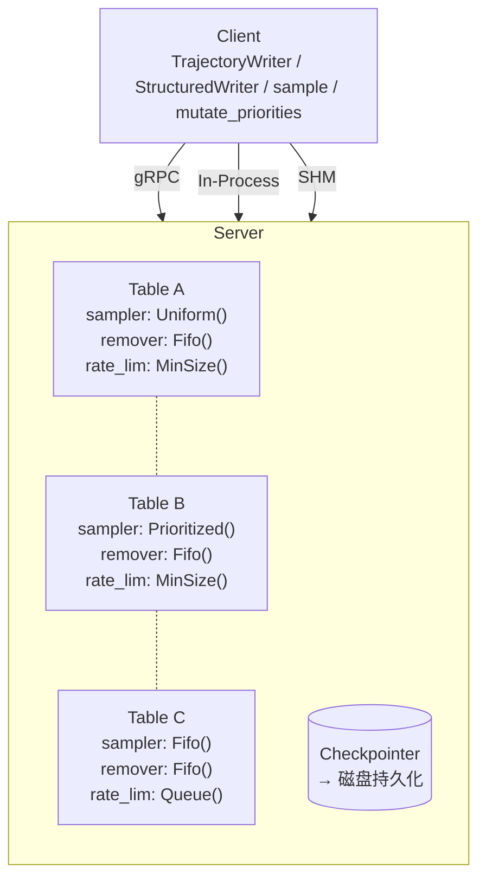
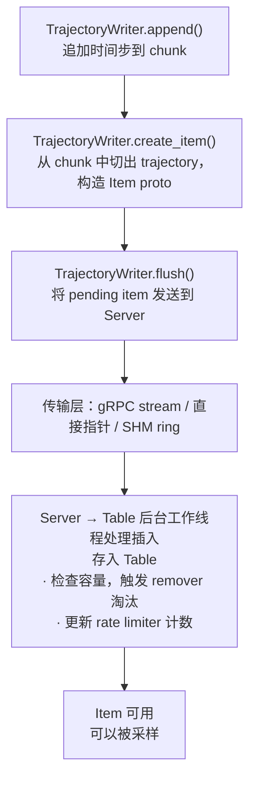
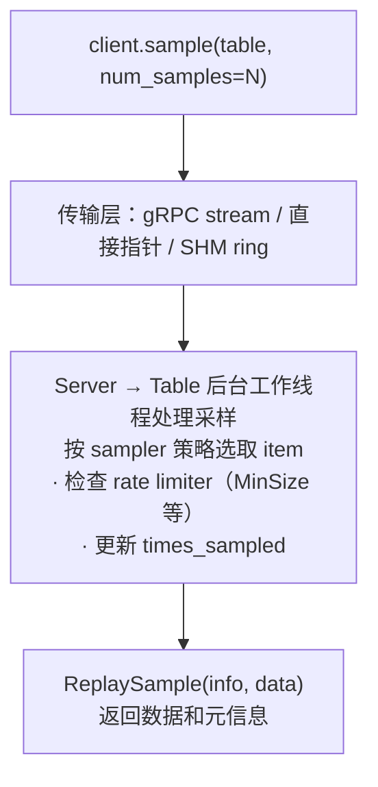

# Reverb 概念与架构

本文档面向**使用者**，回答三个问题：

1. Reverb 是什么，解决什么问题？
2. 它由哪些模块组成，各自负责什么？
3. 数据在系统里怎么流动？

读完本文后，你会对 Reverb 的全貌有一个清晰的心智模型，然后可以按需跳转到示例、传输层对比、或 API 参考。

---

## 1. 一句话

Reverb 是一个**数据存储与传输系统**，为强化学习的经验回放（experience replay）而设计，同时也适用于任何需要在训练循环中高效存取数据的场景——例如存储模型权重、构建数据管道、或实现优先级队列。

它由 C++ 实现核心逻辑，通过 Python 暴露 API，数据载体为纯 numpy 数组（本 fork 不依赖 TensorFlow）。

用三行代码感受一下：

```python
server = reverb.Server([reverb.Table.queue('q', 100)], in_process=True)
with server.in_process_client.trajectory_writer(num_keep_alive_refs=1) as w:
    w.append({'x': np.array([1.0])}); w.create_item('q', 1.0, {'x': w.history['x'][:]}); w.flush()
sample = next(server.in_process_client.sample('q', 1, emit_timesteps=False))
```

（别急，每个概念都会在下面详细解释。）

---

## 2. 架构一览



**核心思路：** Server 持有若干 Table，每个 Table 是一个独立的「容器 + 采样/移除策略」组合。Client 通过三种传输层之一连接 Server，写入数据或读取样本。传输层对上层核心 API 完全透明——用 `trajectory_writer`、`structured_writer`、`sample`、`mutate_priorities` 时调用方式都一样。**例外：** `ShmClient` 不支持 `Writer`/`insert`（较早的写入 API，功能已被 `TrajectoryWriter` 取代），请使用 `trajectory_writer` 代替。详见 [client-transports.md](client-transports.md)。

> 图中 `sampler`、`remover`、`rate_limiter` 等概念详见下文第 3 节。

---

## 3. 核心概念

### 3.1 Server

Server 是 Reverb 的顶层容器。它：

- 持有一个或多个 Table
- 管理 Table 的后台工作线程（插入、采样、删除、chunk 回收）
- 可选择暴露 gRPC 端口（`in_process=False`）或 SHM 接口（`shm=True`）
- 可选地通过 Checkpointer 在启动时恢复上次的 checkpoint

```python
table_a = reverb.Table(
    name='my_table',
    sampler=reverb.selectors.Uniform(),
    remover=reverb.selectors.Fifo(),
    max_size=1000,
    rate_limiter=reverb.rate_limiters.MinSize(100),
)
table_b = reverb.Table(
    name='my_other_table',
    sampler=reverb.selectors.Prioritized(0.8),
    remover=reverb.selectors.Fifo(),
    max_size=500,
    rate_limiter=reverb.rate_limiters.MinSize(50),
)

server = reverb.Server(
    tables=[table_a, table_b],
    in_process=True,   # 允许同进程直连（LocalClient）
    shm=True,          # 额外启动共享内存传输层（ShmClient）
    port=8000,          # gRPC 端口（in_process=False 时有效）
)

# 查看 Server 中所有 Table 的状态
client = server.in_process_client
info = client.server_info()  # Dict[str, TableInfo]
print(info['my_table'].current_size)  # 当前 item 数量
```

**关键理解：** `in_process=True` 和 `shm=True` 是独立的开关。前者让同进程代码可以零开销访问 Table，后者让同机器的其他进程可以通过共享内存访问。两者可以同时开启。

### 3.2 Table

Table 是 Reverb 的核心抽象——一个带有存、取、删策略的数据容器。每个 Table 由以下要素定义：

| 要素 | 作用 | 示例 |
|---|---|---|
| `name` | 唯一标识符 | `'my_replay_buffer'` |
| `sampler` | 决定「取哪条」的策略 | `selectors.Uniform()` |
| `remover` | 决定「淘汰哪条」的策略 | `selectors.Fifo()` |
| `max_size` | 最大 item 数量 | `1000` |
| `rate_limiter` | 控制存取速率 | `rate_limiters.MinSize(100)` |
| `max_times_sampled` | 每条 item 最多被采样的次数 | `1`（Queue 模式） |
| `signature` | 可选，声明每条 item 的数据结构（dtype + shape），用于校验和解包 | `{'obs': signature_codec.TensorSpec(shape=(84,84), dtype=np.float32)}`（需 `from reverb import signature_codec`） |

Table 的灵活性来自 sampler、remover、rate_limiter 三者的组合。例如：

- **Uniform Experience Replay:** `Uniform + Fifo + MinSize(100)` — 等概率采样，最旧的淘汰，保证至少 100 条才让采
- **Prioritized Experience Replay:** `Prioritized(0.8) + Fifo + MinSize(100)` — 按优先级加权采样
- **Queue:** `Fifo + Fifo + Queue(size=N)` — 先进先出，每条只采一次就删除。快捷构造：`reverb.Table.queue(name, max_size)`
- **Stack:** `Lifo + Lifo + Stack(size=N)` — 后进先出。快捷构造：`reverb.Table.stack(name, max_size)`

### 3.3 Client（三种传输层）

Reverb 提供三种 Client，对应三种不同的通信路径。**API 完全一致**——只需改构造方式。

| Client | 构造方式 | 适用场景 | 性能 |
|---|---|---|---|
| `Client` (gRPC) | `reverb.Client('host:port')` | 跨机器 / 分布式 | 基线（gRPC 序列化开销） |
| `LocalClient` | `server.in_process_client` | 同进程内嵌 | 最快（零拷贝，直接持有 Table 指针） |
| `ShmClient` | `reverb.ShmClient(server.shm_socket_path)` | 同机器跨进程 | 约 gRPC 的 9-11 倍（mmap 零拷贝） |

```python
# 三种构造方式，API 完全一致
client = reverb.Client('localhost:8000')                 # gRPC
client = server.in_process_client                         # LocalClient
client = reverb.ShmClient(server.shm_socket_path)        # ShmClient
```

**选型原则：** 能在同进程搞定就用 `LocalClient`；需要跨进程就优先 `ShmClient`（同机器）或 `Client`（跨机器）。详见 [client-transports.md](client-transports.md)。

### 3.4 Item 与 Data Element

这是最容易混淆的概念。

- **Data Element**：实际存储的数据，是一个 numpy 数组
- **Item**：对若干 Data Element 的**引用**（不是拷贝）

一条 Item 可以引用多个 Data Element（比如 `{'obs': ..., 'action': ..., 'reward': ...}`）。多条 Item 可以引用同一个 Data Element（比如两条轨迹共享同一个 observation）。只有当没有任何 Item 引用某个 Data Element 时，它才会被实际删除。

```
Item A ──► Data Element 1 (obs_step0)
       ──► Data Element 2 (action_step0)

Item B ──► Data Element 1 (obs_step0)    ← 和 Item A 共享
       ──► Data Element 3 (action_step1)
```

这种引用结构使得在 Table 间共享数据开销极低——同一份 observation 可以同时存在于 PER 表和 FIFO 表中，各表独立决定自己的采样和淘汰策略。

### 3.5 TrajectoryWriter 与 StructuredWriter

写入数据的两种方式：

**TrajectoryWriter**（底层、灵活）

```python
with client.trajectory_writer(num_keep_alive_refs=10) as writer:
    writer.append({'obs': obs, 'action': action})
    writer.create_item(
        table='my_table',
        priority=1.0,
        trajectory={'obs': writer.history['obs'][:],
                    'action': writer.history['action'][:]})
    writer.flush()
```

- 通过 `append` 追加时间步，通过 `history` 切出轨迹片段
- `num_keep_alive_refs` 控制 `history` 能回溯多少步，也就是 `trajectory` 参数可引用的最大轨迹长度
- `writer.history['key']` 返回 `TrajectoryColumn`；用 `[:]` 索引转换为 numpy 数组
- 每次 `create_item` 都需要手动指定 table、priority、trajectory
- 适合需要精确控制轨迹构造方式的场景

**StructuredWriter**（高层、声明式）

```python
from reverb import structured_writer as sw

# 定义 step 的结构（叶子值不重要，只看嵌套关系）
step_structure = {'obs': None, 'action': None, 'reward': None}
ref = sw.create_reference_step(step_structure)

# ref['obs'][-2:] = 最近 2 步的 obs；具体模式和条件见 examples/
cfg = sw.create_config(pattern={'obs_window': ref['obs'][-2:]}, table='my_table')
writer = client.structured_writer([cfg])
for step in range(100):
    writer.append({'obs': obs, 'action': action, 'reward': reward})
writer.flush()  # 或由 StructuredWriter 在退出时自动 flush
```

- 定义条件和模式，自动路由到对应 Table
- 适合「每 N 步存一条」、「多个 Table 共享同一数据流」的场景
- 详见 `examples/structured_writer.py` 和 `examples/structured_writer_advanced.py`

| 场景 | 推荐 |
|---|---|
| 固定窗口、条件触发、一数据流多表 | `StructuredWriter` |
| 手动切轨迹、复杂依赖、自定义优先级 | `TrajectoryWriter` |

> 历史遗留：`client.writer()` 返回一个更早的 `Writer` 对象，功能与 `TrajectoryWriter` 重叠但不支持轨迹构造。新代码请统一使用 `TrajectoryWriter`。`Writer` 已从 `ShmClient` 中移除。

**写入耐久性：in-flight insert 与 server 关闭**。`flush()` 成功代表数据已送达 server 并入队，不代表已落表。若 server 在插入完成前关闭，在飞 insert 会被丢弃，且**没有**对客户端的状态通道（并发评审 #5，已拍板接受该语义、不改协议）。各传输的实际表现：

- **SHM**：`Stop()` 先 join dispatch 再停表，丢弃产生的 ACK 永远发不出去，客户端实际拿到的是连接错误（可重试），不会假成功。
- **gRPC**：server 主动 `Close()` 时表 worker 的关闭路径会对 pending insert 回调并上报**成功**——这是唯一会「静默丢数据报成功」的场景（典型于 server 重启）。
- 崩溃路径（任何传输）本就无法通知，客户端依赖各自读侧超时/EOF 检出。

要求严格不丢数据的应用：在 `server.stop()` 前确认 writer 已 `flush()` 且 server 消化完积压（`server_info()` 观察表尺寸/rate limiter 稳定），或靠 checkpoint 恢复。

### 3.6 Selector（选择策略）

决定「取哪条」和「淘汰哪条」。所有 Selector 都可用于 `sampler` 或 `remover`。

| Selector | 行为 | 典型用途 |
|---|---|---|
| `Uniform()` | 等概率随机选择 | Uniform Experience Replay 的 sampler |
| `Prioritized(priority_exponent)` | 按优先级加权选择，`priority_exponent=0` 退化为 `Uniform` | PER 的 sampler |
| `Fifo()` | 选择最旧的 | Queue 的 sampler，或任何表的 remover |
| `Lifo()` | 选择最新的 | Stack 的 sampler/remover |
| `MinHeap()` | 选择优先级最低的 | remover：淘汰低价值数据（与 `Prioritized` 不同——`MinHeap` 总是选最小值，`Prioritized` 按指数加权随机） |
| `MaxHeap()` | 选择优先级最高的 | sampler：优先处理高价值数据 |

### 3.7 Rate Limiter（速率控制）

控制「什么时候可以插入/采样」。这是一层准入控制，位于 Table 层面。

| Rate Limiter | 行为 |
|---|---|
| `MinSize(N)` | 表中 item 数 ≥ N 时才允许采样 |
| `SampleToInsertRatio(samples_per_insert, min_size_to_sample, error_buffer)` | 维护「插入数 × ratio ≈ 采样数」，超出容差则阻塞插入或采样 |
| `Queue(N)` | 每条 item 恰好采样一次后删除；满则阻塞插入，空则阻塞采样 |
| `Stack(N)` | 同 Queue，但后进先出 |

`SampleToInsertRatio` 内建 MinSize 行为（通过 `min_size_to_sample` 参数）：先保证表中有足够 item，再按 ratio 约束插入和采样的速率。`error_buffer` 参数控制 ratio 的容差范围——实际采样数相对于「插入数 × samples_per_insert」的允许偏离程度，超出则阻塞对应操作。每个 Table 只接受一个 RateLimiter，不需要手动组合两个对象。

所有 rate limiter 在条件不满足时会**阻塞** `sample()`/`insert()`。想给阻塞加超时，可以在 `sample()` 和 `flush()` 中传 `timeout_ms` 参数（超时抛出 `DeadlineExceededError`，继承自 `ReverbError`）。想非阻塞地检查是否可插入/采样，使用 Table 的方法 `table.can_sample(num_samples)` / `table.can_insert(num_inserts)`。

如需清空一个 Table 的所有内容并重置 rate limiter：

```python
client.reset('my_table')
```

### 3.8 ReplaySample 与 SampleInfo

`client.sample(table_name, num_samples=N)` 返回一个生成器。默认 `emit_timesteps=True` 时，每次迭代产出 `List[ReplaySample]`（按时间步展开的列表）；设 `emit_timesteps=False` 则每次迭代直接产出单个 `ReplaySample`。

```python
class ReplaySample(NamedTuple):
    info: SampleInfo      # 元信息
    data: object          # 实际数据，结构由 Table 的 signature 决定
```

`SampleInfo` 的结构：

```python
class SampleInfo(NamedTuple):
    key: int              # item 的唯一标识符
    probability: float    # 采样概率（用于 importance sampling 修正）
    table_size: int       # 采样时表中的 item 数量
    priority: float       # item 的优先级
    times_sampled: int    # 该 item 已被采样的次数
```

`key` 和 `probability` 是 PER 中计算 importance sampling weight 的关键字段。采样后如需更新或删除优先级，使用：

```python
# 更新优先级
client.mutate_priorities('my_table', updates={key: new_priority})
# 按 key 删除 item（不带 priority 更新）
client.mutate_priorities('my_table', deletes=[bad_key])
```

### 3.9 Checkpoint（检查点）

Reverb 支持将 Server 的全部状态（Table 内容 + 元数据）持久化到磁盘，并在启动时恢复。

```python
# 保存
checkpoint_path = client.checkpoint()

# 恢复
checkpointer = reverb.checkpointers.DefaultCheckpointer(path=checkpoint_path)
server = reverb.Server(tables=[...], checkpointer=checkpointer)
```

注意点：
- checkpoint 期间 Server 会阻塞所有插入/采样/更新/删除请求
- 恢复时 `tables` 参数必须与写入 checkpoint 时一致
- 具体格式为 length-delimited protobuf（非 TFRecord）

---

## 4. 数据流

### 4.1 Insert 路径



### 4.2 Sample 路径



---

## 5. 传输模式速查

| 模式 | Client 类 | 构造 | 何时用 |
|---|---|---|---|
| 进程内嵌 | `LocalClient` | `server.in_process_client` | 单机训练，训练循环和 replay buffer 在同一进程 |
| 跨机器 | `Client` (gRPC) | `reverb.Client('host:port')` | 分布式 RL，actor 和 learner 在不同机器 |
| 同机跨进程 | `ShmClient` | `reverb.ShmClient(socket_path)` | 多进程单机训练，需要比 gRPC 更快的采样 |

完整对比（API 覆盖、pickle 支持、性能、边界情况）见 [client-transports.md](client-transports.md)。

---

## 6. 下一步

按你的学习目标选择：

- **「给我看代码」** → [examples/demo.py](../examples/demo.py)（核心教程，覆盖轨迹写入、队列、优先级、checkpoint）
- **「我要选传输层」** → [docs/client-transports.md](client-transports.md)（三种 Client 的完整对比与避坑）
- **「我要生产级用法」** → [examples/production_patterns.py](../examples/production_patterns.py)（Queue、Stack、SampleToInsertRatio、flush 背压等 10 个模式）
- **「我要了解设计决策」** → [docs/numpy-embed-design.md](../design/numpy-embed-design.md)（为什么去掉 TensorFlow、架构变更记录）
- **「我要完整 API」** → 参考 `reverb/__init__.py` 中的导出列表，以及各模块的 docstring
