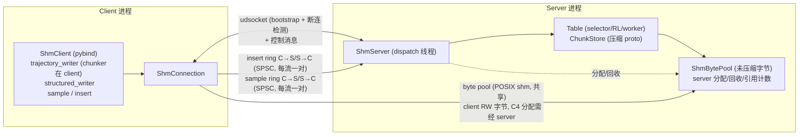
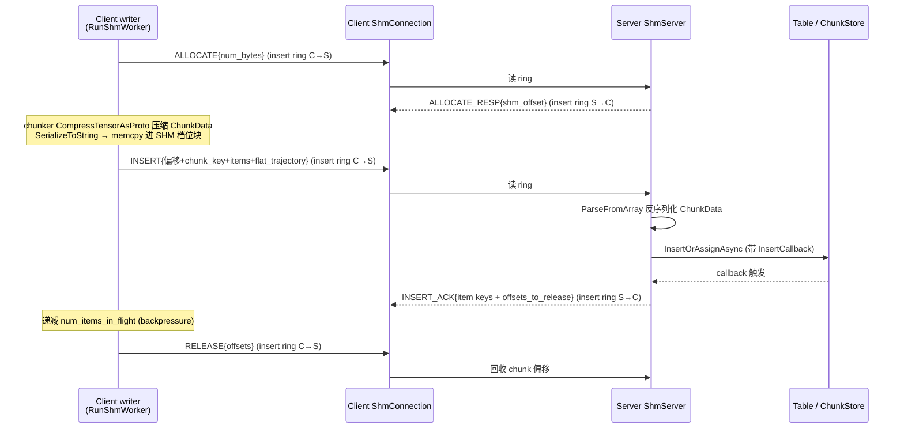
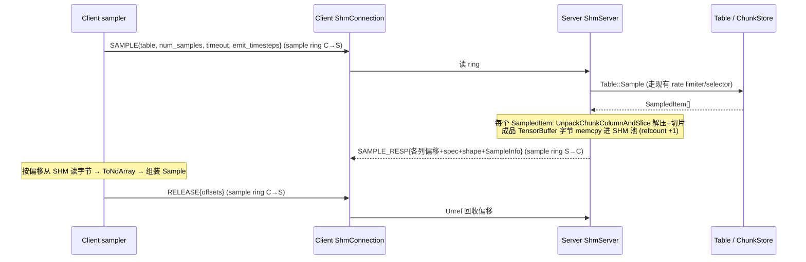

# Reverb 同机分进程共享内存传输设计文档

> 本文档阐述 Reverb 在"同机、Client 与 Server 分属不同进程"场景下，使用
> POSIX 共享内存（SHM）替代 gRPC loopback 进行数据传输的方案。面向已熟悉
> [numpy-embed-design.md](numpy-embed-design.md) 的开发者。

## 0. TL;DR

- **痛点**：同机分进程下，gRPC loopback 对每个 tensor 做 proto 序列化 +
  snappy 压缩/解压，CPU 与内存带宽是瓶颈。sample 路径尤甚——server 存的
  chunk 是压缩的，**每次采样都解压一次**，同一 chunk 解压 N 次。
- **方案**：新增独立 SHM 传输层，与 gRPC / in_process 三路并存。Table 逻辑
  留在 server 进程，SHM 只承载 chunk 字节，控制面走 per-client 双向 SPSC ring
  buffer（每流一对，决策 D）+ server 轮询，bootstrap 用 Unix domain socket。
- **API**：新增 `ShmClient`，镜像 `_BaseClient` 的热路径（sample /
  trajectory_writer / structured_writer），语义与 gRPC / LocalClient 一致。
  v1 未实现冷路径控制面（checkpoint / mutate_priorities / reset / server_info），
  见 §6。

## 1. 动机与边界

### 1.1 要解决的

gRPC loopback（`Client('localhost:port')` 连本机 server）在同机分进程下可用，
但数据路径是：

```
client ndarray
  → CompressTensorAsProto (snappy 压缩 + proto 序列化)   [client CPU]
  → gRPC 序列化 ChunkData                                  [双方 CPU]
  → server 解析 → ChunkStore 存压缩 proto
  → sample 时: DecompressTensorFromProto (每次采样解压)   [server CPU, N 次]
  → gRPC 序列化回传 → client 解析 → DecompressTensorFromProto [双方 CPU]
```

核心浪费：proto 序列化 + snappy 压缩/解压的 CPU 与内存带宽开销，sample 路径
重复解压尤甚。SHM 共享字节，跳过 gRPC 的网络栈与双端序列化往返。

> **实现现状**：sample 路径上 server 仍需从 ChunkStore 解压一次成品字节进
> SHM（每采样一次），但跳过了 gRPC 序列化回传 + client 反序列化。insert 路径上
> 压缩在 client chunker 完成（复用现有 `CompressTensorAsProto`），client 把序列化的
> `ChunkData` proto memcpy 进 SHM，server 反序列化后直接入 ChunkStore，不再二次压缩。
> 即“跳过 gRPC 网络与双端序列化”，而非“全路径零序列化零压缩”。详见 §4.4 与 §8.5。

### 1.2 不解决的

- **跨机**：SHM 不跨机。跨机仍走 gRPC。
- **Table 算法核心**：selector / rate limiter / chunker / worker 线程不动，
  仍在 server 进程。
- **现有 gRPC / in_process 路径**：保留，不改动。

### 1.3 与内嵌模式的差异

| 维度 | in_process（已实现） | shm（本文档） |
| --- | --- | --- |
| 进程关系 | 同进程 | 同机不同进程 |
| Table 访问 | `shared_ptr<Table>` 直接指针 | server 进程独占，client 经控制 ring 请求 |
| chunk 字节 | `shared_ptr<ChunkStore::Chunk>` 共享 | SHM 段共享字节 + server 集中引用计数（瞬态：用完即 RELEASE） |
| 序列化 | 零 | 零网络序列化（控制消息 + insert 走 length-delimited proto） |
| 压缩 | 零（in_process 走 `AsSample(SampledItem)` 直接读 `shared_ptr`） | insert 复用 client chunker 压缩；sample 仍由 server 从 ChunkStore 解压一次进 SHM |

> 注：in_process 的 sample 走 `sampler.cc::AsSample(const Table::SampledItem&)`
> 路径，直接 `shared_ptr<Chunk>` 零拷贝读，本就不压缩。SHM 复刻这套"零压缩读"
> 语义，但字节在 SHM 段而非进程内指针。

## 2. 设计决策汇总

| 编号 | 决策 | 理由 |
| --- | --- | --- |
| S1 | 新增独立 SHM 传输层，与 gRPC / in_process 三路并存 | 不侵入现有 C++ 核心；用户显式选传输 |
| S2 | SHM 只放 chunk 字节，Table 逻辑留 server 进程 | 复杂度量级最低；避免跨进程 shared_ptr / 互斥锁 / worker 调度 |
| S3 | 控制面走 per-client 双向 SPSC ring buffer + server 轮询；每 client **两对** ring（insert 流一对 + sample 流一对） | SPSC 无锁成熟；崩溃隔离好（某 client ring 坏不影响其他）。两对而非一对：insert worker 与 sample worker 是两条后台线程，单对 ring 会违反 SPSC 不变式（两个生产者写同一 `head`，无 CAS → 数据损坏），见决策 D |
| S4 | bootstrap 用 Unix domain socket | POSIX 标准、同机专用、可检测断连 |
| S5 | 字节池用固定档位 slab 分配（9 档：64B/256B/1KB/4KB/16KB/64KB/256KB/1MB/4MB） | 碎片少、回收简单（归位即可） |
| S6 | server 集中管理 SHM 字节引用计数，client 只读不释放 | 语义清晰；client 崩溃时 server 集中释放 |
| S7 | SHM 池与现有 ChunkStore 并存，但 SHM 字节是**瞬态传输缓冲**（insert 字节在 INSERT_ACK 后 RELEASE 回收，sample 字节在 client 读后 RELEASE 回收），仅在传输瞬间与 ChunkStore 双份 | 现有 Table / ChunkStore / sampler 零改动；避免 SHM 池永久占双份内存 |
| S8 | insert：client 把 chunker 已压缩的 `ChunkData` proto 序列化后 memcpy 进 SHM，server 反序列化存档（不再二次压缩） | 复用 chunker 现有压缩；server 零压缩。注：与早期“client 送原始字节、server 压缩”设想不同，实现采用 proto 序列化简化多列处理（见 §8.5） |
| S9 | sample：server 预切片成成品字节进 SHM，client 直接读 | client 侧零计算；每次独立分配不复用 |
| S10 | rate limiter / backpressure 语义对齐现有；v1 **未实现** checkpoint / mutate_priorities / reset / server_info（`ShmClient.server_info()` 返回空） | 热路径（sample/insert）优先；冷路径控制面 v2 补 （`server_info` 已实现 bootstrap 快照 ticket ⑧；`mutate_priorities`/`reset` 已实现 ticket ⑩，走 insert 流 + 客户端互斥锁；`ShmClient` 已可 pickle ticket ⑫；仅 `checkpoint` 待补 ticket ⑪） |
| S11 | Python 新增 `ShmClient`，镜像 `_BaseClient` | API 一致；三路并列 |
| S12 | 支持 trajectory_writer / structured_writer（insert 经 trajectory_writer 的 SHM 路径实现）；plain `Writer` won't fix（无 SHM seam，Python 层 `NotImplementedError`，ticket ⑬） | writer backpressure 经反向 ring confirm |
| S13 | 崩溃恢复：udsocket 断连检测 + 集中释放该 client SHM 偏移 | 简单可靠 |
| S14 | 字节池满：阻塞等待，对齐全语义 | 不报错、不丢数据 |
| S15 | SHM 用 POSIX `shm_open` | 跨平台、与 udsocket 配合自然 |
| D | 每 client **两对** ring（insert 流 C→S/S→C + sample 流 C→S/S→C），共 4 条 ring + 1 个 pool = 5 个 SHM 段 | insert worker 与 sample worker 是两条后台线程，单对 ring 会违反 SPSC 不变式（两个生产者写同一 `head`，无 CAS → 数据损坏）。两对 ring 让每流保持单生产者，无需跨线程同步 |

## 3. 架构总览



> 决策 D：每个 client 连接建立**两对** SPSC ring（insert 流一对 + sample 流一对）
> 加 1 个共享 byte pool，共 5 个 SHM 段。单对 ring 会让 insert/sample 两条后台线程
> 同时写同一 `head`，违反 SPSC 不变式（见 §2 决策 D）。

**数据流（insert）**：



> 注：实现采用 ALLOCATE/ALLOCATE_RESP 两步先向 server 申请偏移（C4，集中分配保证
> server 单线程无锁），再 memcpy + INSERT。早期设想“client 送原始字节、server 压缩”
> 未采用——压缩复用 chunker 既有逻辑，server 不再二次压缩。

**数据流（sample）**：



## 4. 组件设计

### 4.1 SHM 字节池 `ShmBytePool`

- **技术**：POSIX `shm_open` + `ftruncate` + `mmap`，固定路径名（由 server 生成，
  bootstrap 时传 client）。
- **布局**：固定档位 slab。实际档位 9 种：64B / 256B / 1KB / 4KB / 16KB /
  64KB / 256KB / 1MB / 4MB（`kDefaultSlabSizes`，可配）。每档位一个 free list
  （偏移链表，`SlabMeta.free_head_offset`）。server 单线程分配/回收（无需跨进程锁）。
  默认每档 256 块（`kDefaultBlocksPerSlab`）。
- **分配（C4）**：client 不自选偏移，而是发 `ALLOCATE{num_bytes}` 请求经
  insert ring C→S，server 单线程选最小够用档位从 free list 取一块返回偏移
  （`ALLOCATE_RESP{shm_offset}`）。无空闲则池满阻塞（S14）。集中分配保证
  server 单线程无锁，client 拿到偏移后再 memcpy。
- **回收**：偏移归还所属档位 free list。
- **引用计数**：server 维护 `map<偏移, refcount>`。sample 发 N 列则各偏移 +1；
  client release 则 -1；归零回收。
- **池满**：阻塞等待（S14）。server 端 `ShmServer` 线程在池满时阻塞，对应的
  client 请求排队（控制 ring 自然背压）。
- **容量**：默认每档 256 块（`kDefaultBlocksPerSlab`）× 9 档，总约 1.3 GB
  （档位与块数均可配）。`slab_sizes` 空时用 `kDefaultSlabSizes`。

> `ponytail:` slab 档位是经验值，profile 后可调。跨进程分配单线程化是简化——
> 若 server dispatch 成瓶颈，升级为 per-档位 spinlock。

### 4.2 控制面 `ShmCtrlRing`（per-client 双向 SPSC，每流一对）

- **结构**：每个 client 连接时，server 为其创建**两对** SPSC ring（POSIX shm，
  决策 D）：
  - insert 流：`insert_c2s`（client 写 ALLOCATE/INSERT/RELEASE，server 读）/ `insert_s2c`（server 写 ALLOCATE_RESP/INSERT_ACK，client 读）
  - sample 流：`sample_c2s`（client 写 SAMPLE/RELEASE，server 读）/ `sample_s2c`（server 写 SAMPLE_RESP/ERROR，client 读）
- **为何两对**：insert worker 与 sample worker 是 client 进程内两条独立后台线程。
  单对 ring 会让两个生产者写同一 `head`，违反 SPSC 不变式（无 CAS → 数据损坏）。
  拆成两对后每流单生产者/单消费者，无需跨线程同步。
- **SPSC 实现**：经典无锁单生产者单消费者 ring，`head`/`tail` 原子变量，各自
  独占 cache line（`RingHeader` 128B = 2 cache line）防 false sharing。容量默认
  1024 槽，每槽默认 256B（含 16B `SlotHeader`）。大数据用 SHM 偏移引用。
- **消息类型**：定长 `SlotHeader`（seq + msg_type + flags + body_len）+ 变长 body
  （length-delimited proto）。body 超单槽时跨槽拼接（HAS_CONT/IS_CONT flags）。
- **server 轮询**：`ShmServer` 单 dispatch 线程轮询所有 client 的两条 C→S ring
  （insert + sample），dispatch 到 Table。响应写回对应流的 S→C ring。

> `ponytail:` SPSC ring 不用信号量（避免崩溃泄漏），靠 server 主动轮询。延迟
> 由轮询间隔决定（默认忙等或 `sched_yield`）。若延迟敏感，升级为 eventfd 通知。

### 4.3 Bootstrap 与连接 `ShmBootstrap`

- **server 侧**：启动时创建主 SHM 字节池段（POSIX shm，生成唯一路径名如
  `/reverb_shm_pool_<pid>`），并在一个 Unix domain socket 路径上 listen。
- **client 侧**：连 udsocket，发送 `Hello{client_pid, protocol_version}`。
  server `accept` 时用 `SO_PEERCRED` 核验 client pid，为该 client 创建**两对**
  ring 段（`/reverb_shm_insert_c2s_<spid>_<cpid>` 等 4 条），回
  `Welcome{pool_shm_name, insert_c2s/s2c_shm_name, sample_c2s/s2c_shm_name,
  server_info}`。client `mmap` 五段（pool + 4 条 ring）。
  （旧 `c2s_shm_name`/`s2c_shm_name` 字段保留但 `deprecated`。）
- **断连检测**：server 监听 udsocket EOF（`poll`+`MSG_PEEK`），判定 client 断连，
  集中释放该 client 所有未 release 的 SHM 偏移（`outstanding_offsets_` 集合），
  `shm_unlink` 四条 ring 段。

### 4.4 server 侧 `ShmServer`

- **线程模型**：一个 dispatch 线程轮询所有 client 的两条 C→S ring（insert +
  sample）+ 借用现有 `Table::table_worker_`（经 `InsertOrAssignAsync` 回调）。
- **insert 处理**：读 insert ring C→S 请求 → ALLOCATE 时从池选档位返回偏移 →
  INSERT 时从 SHM 偏移读字节 `ParseFromArray` 反序列化 `ChunkData`（client 已压缩，
  server 不再二次压缩）→ 构造 `ChunkStore::Chunk` → `Table::InsertOrAssignAsync`
  （带 `InsertCallback`，回调存 `ClientState.pending_insert_callbacks` 保活）
  → callback 全部触发后往 insert ring S→C 写 `INSERT_ACK`（item keys +
  `offsets_to_release`）。
- **sample 处理**：读 sample ring C→S 请求 → `Table::Sample`（现有 rate
  limiter/selector）→ 对每个 `SampledItem` 调 `UnpackChunkColumnAndSlice`（现有
  逻辑）解压切片 → 成品字节 memcpy 进 SHM 池（refcount +1）→ sample ring S→C 写
  `SAMPLE_RESP`（各列偏移 + spec + shape + `SampleInfo`）。
- **与 ChunkStore 关系**：SHM 池是 ChunkStore 之外的**瞬态**数据面。insert 时
  server 反序列化进 ChunkStore 后，SHM 偏移随 `INSERT_ACK` 的 `offsets_to_release`
  回收；sample 时 server 从 ChunkStore 解压成品进 SHM，client 读后 RELEASE 回收。
  两者仅在传输瞬间双份，不作永久第二副本。（早期设想的“insert 字节复用于 sample
  切片源”见 §6，未采用。）

### 4.5 client 侧 `ShmClient`（C++ + pybind）

- **C++ `ShmClient`**：持 `ShmConnection`（udsocket fd + 五段 mmap：pool +
  insert_c2s/s2c + sample_c2s/s2c ring 读写器）。方法镜像 `InProcessClient`：
  `Sample` / `NewTrajectoryWriter` / `NewStructuredWriter` / `NewSampler`。
  `MutatePriorities` / `Reset` 已实现（ticket ⑩，走 insert 流）；`ServerInfo`
  返回 bootstrap 快照（ticket ⑧）；`Checkpoint` 未实现。`Insert`（plain `Writer`）
  **won't fix**——legacy `Writer` 无 SHM seam，Python 层覆盖为 `NotImplementedError`
  （ticket ⑬），用 `trajectory_writer` / `structured_writer`。`ShmClient` 可 pickle
  （ticket ⑫，存 `socket_path` 重连）。
- **trajectory_writer**：chunker/column 逻辑在 client 进程（复用现有
  `TrajectoryWriter`，只把 `RunLocalWorker` 的 `InsertOrAssignAsync` 换成
  `RunShmWorker`：ALLOCATE 申请偏移 → memcpy 序列化 `ChunkData` proto → INSERT →
  等 ALLOCATE_RESP/INSERT_ACK → RELEASE）。backpressure：`local_can_insert_more_`
  等 confirm 信号（对齐 D2）。
- **sample**：发请求到 sample ring C→S → 轮询 sample ring S→C → 按偏移读 SHM
  字节 → `TensorBuffer` → `ToNdArray` → 组装 `Sample`。读完发 RELEASE 回收偏移。
- **pybind**：暴露 `ShmClient(udsocket_path)`，snake_case + PascalCase 双名别名
  （对齐 §3.3 的 gRPC/LocalClient 共享路径策略）。

### 4.6 Python 层

- `reverb/client.py`：新增 `ShmClient(_BaseClient)`。`_BaseClient` 的
  `sample`/`insert`/`mutate_priorities`/`reset`/`server_info`/`checkpoint` 共享
  逻辑靠 `self._client`（C++ `ShmClient`）鸭子类型分派。`trajectory_writer`/
  `structured_writer` 不收 table 参数（对齐 gRPC/LocalClient）。
- `reverb/server.py`：`Server` 新增 `shm=True` / `shm_socket_path=...` 参数。
  `shm=True` 时起 `ShmServer`（含 udsocket + 字节池），`server.shm_socket_path`
  供 client 连。可与 `in_process` / `port` 组合或互斥（见 §5）。v1 `ShmServer` 只
  持一张表（`tables[0]`），多表待后续。（已实现，ticket ⑨：按表名路由全部表）
- pickle 已支持（ticket ⑫）：`__reduce__` 返回 `(ShmClient, (socket_path,))`，反序列化重连，无跨进程泄漏。

## 5. 模式组合矩阵

| Server 构造 | gRPC | in_process | shm |
| --- | --- | --- | --- |
| `Server(tables, port=8000)` | ✓ | ✗ | ✗ |
| `Server(tables, in_process=True)` | ✗ | ✓ | ✗ |
| `Server(tables, shm=True)` | ✗ | ✗ | ✓ |
| `Server(tables, port=8000, shm=True)` | ✓ | ✗ | ✓ |
| `Server(tables, in_process=True, shm=True)` | ✗ | ✓ | ✓ |

- gRPC、in_process、shm 三者可按需组合（同进程内嵌 + 同机跨进程并存）。
- client 侧按需用 `Client(addr)` / `server.in_process_client` / `ShmClient(path)`。

## 6. 未决 / 后续

- **insert 字节复用于 sample 切片源（未采用）**：早期设想 client insert 时送的
  SHM 字节，sample 时 server 可直接基于它切片，省去“压缩进 ChunkStore 再解压”
  的一次往返。需 server 维持 `chunk_key → SHM 偏移` 索引。v1 实现中 insert 字节
  是瞬态（INSERT_ACK 后即 RELEASE），未做此复用，sample 仍从 ChunkStore 解压。
  可作为 v2 优化。
- **insert（单步）API**：经 `trajectory_writer` 的 `RunShmWorker` 路径已实现
  （ALLOCATE → memcpy 序列化 proto → INSERT → INSERT_ACK → RELEASE）；plain
  `Writer` 类的 SHM 路径 **won't fix**（无 SHM seam，Python 层覆盖为
  `NotImplementedError`，ticket ⑬），用 `trajectory_writer` / `structured_writer`。
- **控制面冷路径**：`mutate_priorities` / `reset` / `server_info` 已实现
  （`mutate_priorities`/`reset` 走 insert 流 + 客户端互斥锁，ticket ⑩；
  `server_info` 为 bootstrap 快照，ticket ⑧）；`checkpoint` 仍待补（ticket ⑪）。
  热路径（sample/insert）已完整。
- **多 server 进程**：本文档不涉及（一个 server 进程，多 client）。v1 `ShmServer`
  只持一张表（`tables[0]`），多表待后续。（已实现，ticket ⑨：按表名路由全部表）
- **SHM 段权限**：POSIX shm 默认仅同用户。跨用户场景需 `chmod`/`chown`，后续按需。

## 7. 与 numpy-embed-design.md 的关系

- 本方案是 numpy-embed-design 的**同机跨进程扩展**，复用其 `TensorBuffer` /
  `ChunkData` / `SimpleCheckpointer` / `_BaseClient` 抽象。
- 不改动 numpy-embed-design 已定的任何决策（A1–D3），仅在传输层新增第三条路径。
- `TensorBuffer` 的"拷贝 bytes 语义"在 SHM 下自然延伸：SHM 段就是一块共享的
  bytes 缓冲，`TensorBuffer::bytes()` 可直接指向 SHM 偏移（零进程内拷贝）。
- ponytail 升级路径一致：SHM 字节池本身已是"零拷贝共享"，numpy-embed-design 里
  `TensorBuffer` 的零拷贝升级（裸指针 + DeferredFreeQueue）是正交的进程内优化。

## 8. SPSC ring 协议规范（可实现粒度）

本节是 §4.2 的展开。定义字节级布局、消息类型、流控、错误处理，供 dispatch
线程、pool、bootstrap 直接照写。

### 8.1 内存布局

每条 ring 是一个独立 POSIX shm 段，固定大小，`mmap` 后按以下 C 结构体布局
（POD，无指针，跨进程安全）：

```c
// 段头(128 字节 = 2 cache lines)。
// head(生产者)在 line 0，tail(消费者)在 line 1，两者不共享 cache line
// 防 false sharing。均从 1 开始(seq 0 表示槽从未写过)。
// 显式字段布局 + pad，不靠 alignas(64) 成员（那会肨大结构体）。
struct RingHeader {
  // Line 0 (offset 0..63).
  uint64_t magic;          // 0x524556524253484D ("REVRBSHM")
  uint32_t version;        // 协议版本, 当前 1
  uint32_t capacity;       // 槽位数(2 的幂), 默认 1024
  uint32_t slot_size;      // 每槽字节数(含 SlotHeader), 默认 256
  uint32_t reserved;       // 对齐填充
  uint64_t capacity_mask;  // capacity - 1, 用于 seq & capacity_mask
  // ponytail: 这两个必须是 atomic, SPSC 无锁靠 release/acquire 配对
  std::atomic<uint64_t> head;   // 生产者: 下一个要写的槽的 seq(从 1 开始)
  uint64_t pad0[3];             // 填满 line 0 到 64 字节
  // Line 1 (offset 64..127).
  std::atomic<uint64_t> tail;   // 消费者: 下一个要读的槽的 seq
  uint64_t pad1[7];             // 填满 line 1 到 64 字节
};
static_assert(sizeof(RingHeader) == 128);  // 必须 2 cache lines
// 紧随其后的 slots 区: capacity 个 slot_size 槽
// 注: SlotHeader.seq 是普通 uint64_t(非 atomic), 靠 head/tail 的
//     release/acquire 建立可见性; 但写入时先填 body 最后置 seq 的顺序需保证,
//     见 §8.4 说明
```

> **命名说明**：实现中用 `head`/`tail` 而非本节早期描述的 `producer_seq`/
> `consumer_seq`，语义完全等价（head = 生产者下一个 seq，tail = 消费者下一个 seq）。
> §8.4 的伪代码保留 `producer_seq`/`consumer_seq` 名以贴近 SPSC 通用术语。

- **seq 而非 index**：用单调递增的 `seq`（从 1 开始），槽位 = `seq & capacity_mask`。
  比裸 index 多一位冗余，能区分"空"与"满"（满: producer_seq - consumer_seq ==
  capacity）。避免"满空不可区分需留一槽"的常见 ring 陷阱。
- **slot 占用判定**：每槽首 8 字节存"写入该槽的 producer_seq"（见 `SlotHeader`）。
  消费者读到 `slot.seq == consumer_seq` 表示槽有效；`slot.seq < consumer_seq`
  表示未写入或已被越过（跳过）。
- **容量**：`slot_size` 默认 256 字节，`capacity` 默认 1024（= 256KB/段）。控制
  消息多在单槽内；超长消息走 §8.4 的跨槽拼接。两值 2 的幂，位运算取模。

### 8.2 槽位结构

```c
struct SlotHeader {
  uint64_t seq;            // 写入方的 producer_seq(消费者据此判有效)
  uint16_t msg_type;       // 见 §8.3 消息类型表
  uint16_t flags;          // bit0: HAS continuation(跨槽); bit1: IS continuation
  uint32_t body_len;       // 本槽 body 字节数(<= slot_size - sizeof(SlotHeader))
};
// 紧随 body: slot_size - sizeof(SlotHeader) 字节
```

- **单槽消息**：`flags == 0`，`body_len` 为实际长度，body 即完整消息。
- **跨槽消息**（body 超单槽容量）：首槽 `flags |= HAS_CONT`，后续槽
  `flags |= IS_CONT`，末槽无 `HAS_CONT`。消费者按 `msg_type` 知道如何拼接。
  body 内承载的是一条 length-delimited proto（消息类型对应 proto，见 §8.3），
  跨槽即对该 proto 字节流分段。

### 8.3 消息类型（C→S 与 S→C）

消息体统一用 length-delimited protobuf（varint 长度前缀 + proto bytes），与现有
`reverb_service.proto` 字段对齐，便于复用现有 proto 定义。SHM 专有新增 proto 在
`reverb/cc/shm/shm_protocol.proto`。

#### C→S 请求（client 写，server 读）

v1 已实现：`HELLO` / `INSERT` / `SAMPLE` / `RELEASE` / `ALLOCATE` / `CLOSE`。
`MUTATE_PRIORITIES` / `RESET` / `CHECKPOINT` / `SERVER_INFO` 未实现（v2 补，见 S10）。

| type 值 | msg_type 名 | body proto | 对应现有 RPC | v1 |
| --- | --- | --- | --- | --- |
| 1 | `HELLO` | `HelloRequest{client_pid, protocol_version}` | bootstrap（仅初始一次，走 udsocket，见 §8.6） | ✓ |
| 2 | `INSERT` | `ShmInsertRequest`（见下） | InsertStream | ✓ |
| 3 | `SAMPLE` | `ShmSampleRequest{table, num_samples, timeout_ms, emit_timesteps}` | SampleStream | ✓ |
| 4 | `RELEASE` | `ShmReleaseRequest{repeated uint64 offsets}` | SHM 专有（回收字节池偏移，insert/sample 流均可收） | ✓ |
| 5 | `ALLOCATE` | `ShmAllocateRequest{num_bytes}` | SHM 专有（C4：client 向 server 申请字节池偏移） | ✓ |
| 9 | `CLOSE` | 空 | client 主动关闭 | ✓ |
| — | `MUTATE_PRIORITIES` | `MutatePrioritiesRequest`（复用现有 proto） | MutatePriorities | 未实现 |
| — | `RESET` | `ResetRequest{repeated string table_names}`（复用） | Reset | 未实现 |
| — | `CHECKPOINT` | `CheckpointRequest`（复用） | Checkpoint | 未实现 |
| — | `SERVER_INFO` | `ServerInfoRequest`（复用） | ServerInfo | 未实现 |

> 注：早期设计表把 type 5 预留给 `MUTATE_PRIORITIES`，实现中 5 被用于 `ALLOCATE`
> （C4 集中分配流程）。`RESET`/`CHECKPOINT`/`SERVER_INFO` 未占号，待 v2 统一分配。

```protobuf
// shm_protocol.proto (新增)
message ShmInsertRequest {
  // trajectory/item 元信息(对齐 InsertStreamRequest, 但 chunk 字节走 SHM)
  repeated ShmChunkRef chunks = 1;       // 替代 InsertStreamRequest.chunks
  repeated PrioritizedItem items = 2;   // 复用现有 proto, flat_trajectory 引用 chunk_key
  repeated uint64 keep_chunk_keys = 3;
}
message ShmChunkRef {
  uint64 chunk_key = 1;
  uint64 shm_offset = 2;        // ShmBytePool 偏移
  uint64 length = 3;            // 字节数
  TensorSpecProto spec = 4;     // dtype + shape(每列一个 ref? 见 §8.5)
  SequenceRange sequence_range = 5;
  bool delta_encoded = 6;
  int32 num_columns = 7;
}
message ShmSampleRequest {
  string table = 1;
  int64 num_samples = 2;
  int64 timeout_ms = 3;          // rate_limiter_timeout
  bool emit_timesteps = 4;
}
message ShmReleaseRequest {
  repeated uint64 offsets = 1;   // 读完的 SHM 偏移, server 递减引用计数
}
message HelloRequest {
  int32 client_pid = 1;
  uint32 protocol_version = 2;
}
// C4: client 向 server 申请字节池偏移
message ShmAllocateRequest {
  uint64 num_bytes = 1;
}
```

> **实现现状**：`ShmChunkRef` 的 `spec`/`sequence_range`/`delta_encoded`/`num_columns`
> 字段在实现中**不填充**（client `RunShmWorker` 仅设 `chunk_key`/`shm_offset`/
> `total_length`），因为传输的是序列化的 `ChunkData` proto 本身，server 直接
> `ParseFromArray` 反序列化拿到全部列信息，无需按 spec 拆列（`ponytail:` 标注冗余）。
> proto 定义保留以对齐 §8.5 的多列设想。

#### S→C 响应（server 写，client 读）

v1 已实现：`WELCOME` / `INSERT_ACK` / `SAMPLE_RESP` / `ALLOCATE_RESP` / `ERROR`。
`MUTATE_ACK` / `RESET_ACK` / `CHECKPOINT_RESP` / `SERVER_INFO_RESP` 未实现。

| type 值 | msg_type 名 | body proto | 对应 | v1 |
| --- | --- | --- | --- | --- |
| 101 | `WELCOME` | `WelcomeResponse{pool_shm_name, insert_c2s/s2c_shm_name, sample_c2s/s2c_shm_name, server_info}` | bootstrap 响应 | ✓ |
| 102 | `INSERT_ACK` | `InsertAck{repeated uint64 keys, repeated uint64 offsets_to_release}` | InsertStreamResponse + SHM 偏移回收 | ✓ |
| 103 | `SAMPLE_RESP` | `ShmSampleResponse`（见下） | SampleStream | ✓ |
| 104 | `ALLOCATE_RESP` | `ShmAllocateResponse{shm_offset}` | SHM 专有（C4：返回授予的偏移） | ✓ |
| 105 | `ERROR` | `ShmError{code, message, request_seq}` | 统一错误 | ✓ |
| — | `MUTATE_ACK` | `MutatePrioritiesResponse`（复用） | | 未实现 |
| — | `RESET_ACK` | `ResetResponse`（复用） | | 未实现 |
| — | `CHECKPOINT_RESP` | `CheckpointResponse`（复用） | | 未实现 |
| — | `SERVER_INFO_RESP` | `ServerInfoResponse`（复用） | | 未实现 |

> 注：早期设计表把 104 预留给 `ERROR`、105 预留给 `MUTATE_ACK`。实现中 104 被
> `ALLOCATE_RESP` 占用、`ERROR` 后移到 105（值偏移），未实现项未占号。

```protobuf
message ShmSampleResponse {
  repeated ShmSample samples = 1;
}
message ShmSample {
  SampleInfo info = 1;                 // 复用现有 proto(key/priority/probability...)
  repeated ShmColumn columns = 2;      // 每列一个
}
message ShmColumn {
  uint64 shm_offset = 1;       // 成品字节偏移(server 预切片后)
  uint64 length = 2;
  TensorSpecProto spec = 3;    // dtype + shape
  bool squeeze = 4;            // 对齐 FlatTrajectory.Column.squeeze
}
message WelcomeResponse {
  string pool_shm_name = 1;
  string c2s_shm_name = 2 [deprecated = true];   // 旧单对 ring 字段, 保留兼容
  string s2c_shm_name = 3 [deprecated = true];
  ServerInfoResponse server_info = 4;  // 含各表 signature, 供 writer 校验
  string insert_c2s_shm_name = 5;      // 决策 D: insert 流 ring
  string insert_s2c_shm_name = 6;
  string sample_c2s_shm_name = 7;      // 决策 D: sample 流 ring
  string sample_s2c_shm_name = 8;
}
message InsertAck {
  repeated uint64 keys = 1;                 // 已插入 item key
  repeated uint64 offsets_to_release = 2;   // insert 用完的 chunk SHM 偏移, client 可释放
}
// C4: server 返回授予的偏移
message ShmAllocateResponse {
  uint64 shm_offset = 1;
}
message ShmError {
  enum Code {
    UNKNOWN = 0;
    DEADLINE_EXCEEDED = 1;   // 映射 Python DeadlineExceededError
    INVALID_ARGUMENT = 2;
    NOT_FOUND = 3;           // 表/chunk 不存在
    RESOURCE_EXHAUSTED = 4;  // 字节池满(理论上阻塞不报错, 保留)
    INTERNAL = 5;
  }
  Code code = 1;
  string message = 2;
  uint64 request_seq = 3;   // 对应请求的 producer_seq, client 匹配
}
```

### 8.4 读写算法（SPSC，无锁）

**生产者写一条消息**（client 写 C→S / server 写 S→C）：

```c
Status Write(Ring* r, uint16_t msg_type, absl::string_view body) {
  // 1. 算需要几个槽
  size_t slot_body_cap = r->slot_size - sizeof(SlotHeader);
  size_t num_slots = (body.size() + slot_body_cap - 1) / slot_body_cap;
  if (num_slots == 0) num_slots = 1;
  if (num_slots > r->capacity) return RESOURCE_EXHAUSTED;  // 消息超 ring 容量

  // 2. 等待连续 num_slots 空槽(满则阻塞, 见 §8.7 backpressure)
  // SPSC: producer 只读 consumer_seq(acquire), 等其推进腾出空间
  uint64_t first_seq = r->producer_seq.load(std::memory_order_relaxed);
  while (first_seq - r->consumer_seq.load(std::memory_order_acquire)
         > r->capacity - num_slots) {
    // ponytail: 忙等或 sched_yield; 无信号量避免崩溃泄漏(§4.2)
    sched_yield();
  }

  // 3. 逐槽写入
  for (size_t i = 0; i < num_slots; i++) {
    uint64_t seq = first_seq + i;
    Slot* s = &r->slots[seq & r->capacity_mask];
    size_t chunk_len = std::min(slot_body_cap, body.size() - i * slot_body_cap);
    s->header.msg_type = (i == 0) ? msg_type : 0;
    s->header.flags = (i + 1 < num_slots) ? HAS_CONT : 0;
    if (i > 0) s->header.flags |= IS_CONT;
    s->header.body_len = chunk_len;
    memcpy(s->body, body.data() + i * slot_body_cap, chunk_len);
    // 关键: 先写完 body, 最后置 seq 发布(release)。consumer 见 seq==期望值
    // 才读 body, acquire 配对保证 consumer 看到上面所有写入。
    // 不需要先清 0: producer 独占写, consumer 只在 seq==consumer_seq 时读,
    // 此槽上一轮的 seq < consumer_seq, consumer 不会误读旧值。
    std::atomic_store_explicit(
        reinterpret_cast<std::atomic<uint64_t>*>(&s->header.seq),
        seq, std::memory_order_release);
  }
  r->producer_seq.store(first_seq + num_slots, std::memory_order_release);
  return OK;
}
```

**消费者读一条消息**（server 读 C→S / client 读 S→C）：

```c
Status Read(Ring* r, uint16_t* msg_type, std::string* body) {
  uint64_t seq = r->consumer_seq.load(std::memory_order_relaxed);
  Slot* s = &r->slots[seq & r->capacity_mask];
  // consumer 读 seq 判就绪; 但需保证读到 seq 后能看到 producer 对该槽 body 的写入。
  // seq 是普通 uint64_t, 靠 producer_seq 的 release 发布可见性: producer 写完槽后
  // store(producer_seq, release), 但 consumer 不读 producer_seq。
  // 正确性靠 SlotHeader.seq 自身的 release/acquire: 此处用 atomic 读 seq。
  uint64_t slot_seq = std::atomic_load_explicit(
      reinterpret_cast<const std::atomic<uint64_t>*>(&s->header.seq),
      std::memory_order_acquire);
  if (slot_seq != seq) return NOT_READY;  // 生产者未写到

  // 收集跨槽消息
  *msg_type = s->header.msg_type;
  body->clear();
  size_t i = 0;
  while (true) {
    body->append(s->body, s->header.body_len);
    bool has_cont = s->header.flags & HAS_CONT;
    if (!has_cont) break;
    i++;
    s = &r->slots[(seq + i) & r->capacity_mask];
    uint64_t cont_seq = std::atomic_load_explicit(
        reinterpret_cast<const std::atomic<uint64_t>*>(&s->header.seq),
        std::memory_order_acquire);
    // IS_CONT 槽的 seq 应连续; 若不连续说明生产者中断(不应发生), 报错
    if (cont_seq != seq + i) return INTERNAL;
  }
  // 消费完所有槽, 推进 consumer_seq(release), 让 producer 看到空间释放
  r->consumer_seq.store(seq + i + 1, std::memory_order_release);
  return OK;
}
```

- **关键正确性**：写方先填字段最后置 `seq`（release），读方先读 `seq` 确认就绪
  再读字段（acquire）。这是 SPSC 无锁 ring 的标准 release/acquire 配对。
- **无信号量**：阻塞靠忙等/yield。避免进程崩溃后信号量泄漏（§4.2 决策）。

### 8.5 insert 的 chunk 多列处理

一个 `ChunkData` 含多列 tensor（`repeated TensorProto tensors`）。SHM 下一个
chunk 的多列字节布局：

- **设计方案（未采用）**：一个 `ShmChunkRef` 对应一个 chunk，其 `shm_offset`/
  `total_length` 指向多列拼接的连续字节，`spec` 字段为 `repeated TensorSpecProto
  specs`（每列一个），server 端按 spec 拆列、调 `CompressTensorAsProto` 各列压缩。

```protobuf
// 设计中的 ShmChunkRef（多列拼接版）
message ShmChunkRef {
  uint64 chunk_key = 1;
  uint64 shm_offset = 2;
  uint64 total_length = 3;          // 多列拼接总长
  repeated TensorSpecProto specs = 4;  // 每列 dtype+shape, 按顺序
  SequenceRange sequence_range = 5;
  bool delta_encoded = 6;
}
```

- **实现现状（采用）**：client `RunShmWorker` 直接把 chunker 产出的 `ChunkData`
  （已含压缩后的 `repeated TensorProto tensors`）`SerializeToString` 成一段连续
  字节 memcpy 进 SHM，`ShmChunkRef` 只填 `chunk_key`/`shm_offset`/`total_length`，
  `specs`/`sequence_range`/`delta_encoded` 留空（`ponytail:` 标注冗余——
  ChunkData 自描述）。server 端不按 spec 拆列，直接 `ParseFromArray` 还原
  `ChunkData` 入 ChunkStore。多列信息隐含在序列化的 proto 里，语义等价但路径更简：

```c
// 实际 HandleInsert（简化）
Status HandleInsert(ShmInsertRequest req, ClientState* cs) {
  for (auto& ref : req.chunks()) {
    ChunkData cd;
    cd.ParseFromArray(pool_.At(ref.shm_offset()), ref.total_length());
    // cd 已含压缩后的 tensors（client chunker 压好），无需再压缩
    auto chunk = std::make_shared<ChunkStore::Chunk>(cd);
    // chunks 存 ChunkStore, items 走 InsertOrAssignAsync...
  }
}
```

> 代价：SHM 上传的是序列化 proto 字节（含 proto 开销），而非裸 numpy 字节。
> 换来的是多列/压缩/delta 等逻辑全复用 chunker 现有实现，server 零解析压力。

### 8.6 Bootstrap 握手时序（udsocket + 初始 ring）

bootstrap 阶段 client 还没有 C→S/S→C ring（ring 是握手产物）。所以握手本身走
udsocket 字节流，不走 ring：

```
1. server 启动:
   - shm_open 创建 pool 段 /reverb_shm_pool_<server_pid>, ftruncate 设容量, mmap
   - unix socket bind+listen 在 /tmp/reverb_shm_<pid>.sock (路径传给 client)

2. client 连接:
   - connect udsocket
   - 发 HelloRequest{client_pid, protocol_version} (4 字节大端长度前缀 + proto)

3. server 收 Hello (accept 时 SO_PEERCRED 核验 client pid):
   - 为该 client 创建**四条** ring 段（决策 D，每流一对）:
     /reverb_shm_insert_c2s_<server_pid>_<client_pid>,
     /reverb_shm_insert_s2c_<server_pid>_<client_pid>,
     /reverb_shm_sample_c2s_<server_pid>_<client_pid>,
     /reverb_shm_sample_s2c_<server_pid>_<client_pid>
   - ftruncate 各 ring 段(RingHeader + capacity*slot_size)
   - mmap, 初始化 RingHeader
   - 回 WelcomeResponse{pool_shm_name, insert_c2s/s2c_shm_name,
     sample_c2s/s2c_shm_name, server_info}
     （server_info 字段 v1 未填充，供 writer 校验的 signature 暂不可用，见 S10）

4. client 收 Welcome:
   - shm_open + mmap 五段(pool, insert_c2s/s2c, sample_c2s/s2c)
   - 之后所有控制消息走对应流的 ring, udsocket fd 保留用于断连检测(§8.8)
```

> `ponytail:` ring 段名含 server_pid + client_pid，避免多 server/多 client 冲突。
> 断连检测靠 udsocket，不靠 ring（ring 无法感知对端进程消失）。

### 8.7 backpressure 与阻塞语义

ring 满时的阻塞行为，对齐 §S10（语义对齐 gRPC）：

- **C→S 满**（client 写太快，server 处理不及）：`Write` 在 client 侧阻塞。
  等价于 gRPC stream 的流控。client writer 的 `local_can_insert_more_` /
  `num_items_in_flight_` 自然受此约束。
- **S→C 满**（server 响应太快，client 读不及）：`Write` 在 server 侧阻塞。
  server dispatch 线程阻塞在此 client 的 S→C，其他 client 仍可处理（除非
  dispatch 单线程——见下）。
- **dispatch 单线程风险**：§4.2 说 server 单线程轮询所有 client 的两条 C→S ring。
  若某 client S→C 满导致 dispatch 阻塞，会饿死其他 client。**对策（已实现）**：
  dispatch 线程对每个 client 的 S→C 写采用非阻塞 `TryWrite`，失败则跳过该 client
  继续轮询下一个，待该 client ring 有空间再回写（响应暂存 per-client per-flow
  outbox 队列：`insert_outbox` + `sample_outbox`）。这样 dispatch 不被慢 client
  阻塞。
- **字节池满**（§S14）：`ShmBytePool::Allocate` 在 server dispatch 线程上用
  `Mutex`+`CondVar` 阻塞等待 free list 有块（`ponytail:` 简化——v1 dispatch 单
  线程，池满时阻塞该请求直到有空间；这会暂停所有 client 的 insert 分配，但
  sample 路径不分配故不受影响）。§8.7 设想的“非阻塞尝试 + 暂存请求”未采用。

### 8.8 断连检测与崩溃恢复

- **正常关闭**：client 发 `CLOSE` 消息（insert C→S ring），server 收到后释放该
  client 所有未 release 偏移，销毁 ring 段（`shm_unlink` 四条 ring），关闭 udsocket。
- **client 崩溃**：udsocket 上 server `poll`+`recv(MSG_PEEK)` 返回 EOF/HUP。server
  判定 client 断，执行集中释放：遍历该 client 的 `outstanding_offsets_` 集合，
  逐个递减引用计数并回收，`shm_unlink` 四条 ring 段。
- **server 崩溃**：client 的 udsocket `recv` 返回 EOF。client 侧报
  `ConnectionError`（所有在途请求失败）。client 持有的 SHM mmap 指针失效。
- **outstanding_offsets_ 追踪**：server 为每 client 维护
  `flat_hash_set<uint64>`，每次 sample 响应发出的偏移加入，每次收到 RELEASE
  移除。崩溃时遍历此集合集中释放。

### 8.9 请求-响应匹配

SHM 是异步 ring，不像 gRPC 一请求一响应同步。匹配靠 `request_seq`：

- client 每发一个请求，记录其 `producer_seq` 作为 `request_seq`。
- 响应（`SAMPLE_RESP`/`INSERT_ACK`/`ERROR` 等）的 body proto 里带 `request_seq`
  字段（或在 `ShmError` 里显式带；成功响应可隐式按顺序匹配，因 SPSC 保序）。
- **简化**：SPSC 保序，同一流的响应顺序与请求顺序一致。client 用阻塞 `read` 按序
  匹配，不必每响应带 seq。

> **实现现状**：`ShmError.request_seq` 字段在 proto 中保留，但 v1 server 构造
> `ShmError` 时**未填充**该字段，client 也不匹配——完全依赖 SPSC 保序隐式匹配
> （insert worker 发 INSERT 后阻塞读 `INSERT_ACK`，sample worker 发 SAMPLE 后
> 阻塞读 `SAMPLE_RESP`，两流各自保序）。`ponytail:` 若未来要支持乱序响应
> （如多 worker 并发处理），再启用显式 seq。
